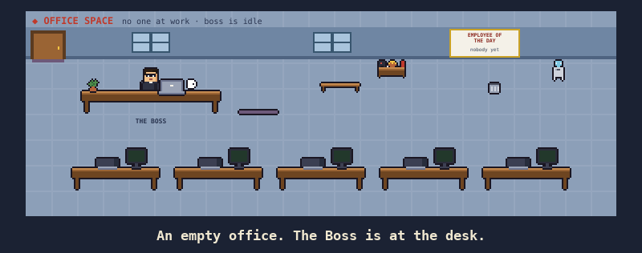
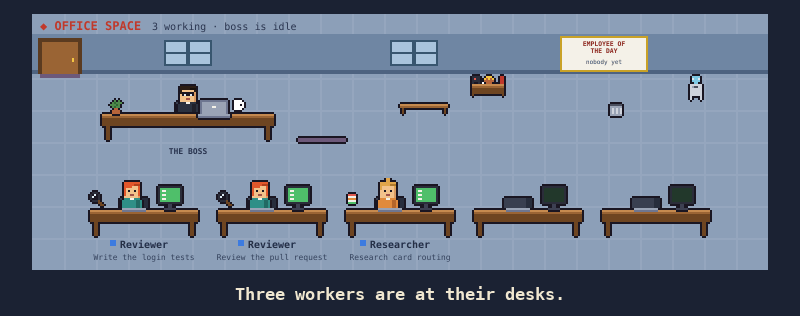
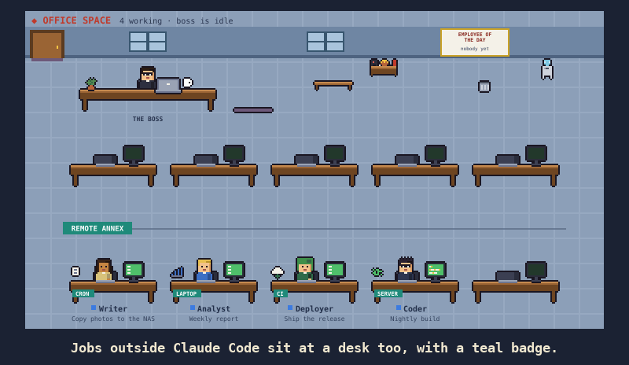
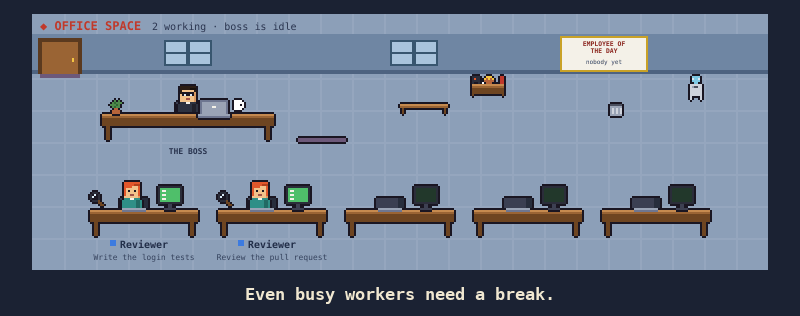

# Office Space



### ▶ Watch the 37-second teaser

https://github.com/user-attachments/assets/13b7944a-4ba9-4aa3-b2d8-5ad59e323084

A Claude Code mod that draws your session as a tiny 16-bit office. The main chat is **The Boss**. Each subagent walks in, picks up its assignment, sits at a desk and works. When it finishes, it walks back to hand in the result and leaves. Jobs running outside the session (a cron job, another machine) can sit at a desk too: see [External workers](#external-workers).

## Quick start

**Before you start:** run `claude --version` in a terminal — you need **2.1.29x or newer**. Older versions say "installed" but the office never loads; update Claude Code first.

1. **Install.** In Claude Code in a terminal, run:
   ```
   /plugin install office-space --marketplace rbrtcnkln1/office-space
   ```
   The two settings shown after install (workers folder, staleness) are optional and have defaults.

   **Using the Claude desktop app?** `/plugin` commands aren't available in the desktop Code tab — paste this into a Code tab chat instead and Claude will run the install for you:
   > Install the Office Space mod for Claude Code: check that `claude --version` is 2.1.29x or newer (if older, tell me to update Claude Code instead). Then run `claude plugin marketplace add rbrtcnkln1/office-space` and `claude plugin install office-space@office-space`. When it's done, tell me to run `/reload-plugins` and then `/office-space`.

   Afterwards, restart the app (or run `/reload-plugins`) and type `/office-space`.
2. **Open the office.** Type `/office-space`. Run it again to close the panel. `/office-space-band` shows or hides a small version above the prompt. `/office-space-help` lists every command.
3. **See it with some staff.** With the office open, clone this repo and run the 60-second demo in a terminal:
   ```bash
   git clone https://github.com/rbrtcnkln1/office-space
   bash office-space/examples/demo.sh
   ```
   Four fake workers start, get blocked or need approval, then finish or fail, and the demo cleans up after itself. Or just ask Claude to run a few subagents.

## Commands

| Command | What it does |
| --- | --- |
| `/office-space` | Open or close the Office Space panel |
| `/office-space-band` | Show or hide the small office strip above the prompt |
| `/office-space-help` | List every Office Space command and setting |
| `/office-space-update` | Check GitHub for a newer version and update to it (see [Updating](#updating)) |
| `/office-space-feedback` | Shows the link to report a bug or share an idea, plus your version details to paste in |

Type `/office-space` in the prompt and the menu lists all of them. The older `/office-space band` still works.

### Settings

The settings are optional and have defaults. Change them in `/plugin` → office-space → configure (or `/config`).

| Setting | Default | What it does |
| --- | --- | --- |
| `workersDir` (External workers folder) | `~/.claude/office-space/workers` | Folder of worker JSON files to show |
| `staleMinutes` (Stale after) | `15` | Minutes without an update before an external worker fades. After 4× that time it leaves |
| `checkForUpdates` (Check for updates daily) | off | Once a day at session start, ask GitHub for the newest version and show one toast if there is one. Off by default |

### Environment variable

`OFFICE_SPACE_WORKERS_DIR` overrides the workers folder. It wins over the setting.

### Scripts

- `examples/office-worker.sh`: writes or updates one worker file safely. Usage: `bash examples/office-worker.sh <id> <working|waiting|blocked|done|failed> "<task>" ["<note>"]`
- `examples/demo.sh`: a 60-second demo with fake workers. Usage: `bash examples/demo.sh`

More commands (customize the Boss, your team and the office) are planned — see the [roadmap issues](https://github.com/rbrtcnkln1/office-space/issues).

## Updating

New versions reach you when the `version` in `plugin/.claude-plugin/plugin.json` is bumped on `main`; a change without a bump is not delivered to installed copies.

**Update now.** Any one of these, then run `/reload-plugins`:

- `/office-space-update` inside Claude Code. It reads your installed version, asks GitHub for the latest, and runs `claude plugin update office-space@office-space` for you if there is a newer one. It does nothing if you are already current, and it tells you the manual steps if it is offline or `claude` on your PATH is missing or older than 2.1.290.
- `/plugin` → Marketplaces → office-space → Update
- `claude plugin update office-space` in a terminal

**Update automatically.** Third-party marketplaces do not auto-update by default (only Anthropic's own do), so turn it on once:

1. Type `/plugin` and open the Marketplaces tab.
2. Choose `office-space`.
3. Choose **Enable auto-update**. The screen then reads "Auto-update enabled".

Claude Code then refreshes the marketplace and updates its installed plugins on startup. Run `/reload-plugins` (or restart) to load a new version in a session that was already open. You can turn it off from the same screen (**Disable auto-update**).

**Privacy.** `/office-space-update` makes one request to `raw.githubusercontent.com/rbrtcnkln1/office-space` (the public `plugin.json`) and nothing else. Office Space makes no other network requests unless you turn on the `checkForUpdates` setting, which repeats that one request at most once a day.

## Requirements

A Claude Code version that supports plugin hook modules (2.1.29x or newer); older versions reject the plugin. It works in the terminal and in the desktop app's Code tab.

## FAQ

**Does it use my context or tokens?** No. It only draws UI: no skills, agents or prompt text, so it adds nothing to Claude's context.

**How do I update?** Type `/office-space-update`, or see [Updating](#updating) for the manual and automatic options.

**How do I uninstall?** `/plugin uninstall office-space`.

## See it in action

Each clip is a short loop drawn by the real renderer (sped up a few times so you don't wait). Regenerate them with [`scripts/media`](scripts/media/README.md).

**Hand-in.** A finished worker walks back to the Boss with the result, and a failed job goes in red. The Employee of the Day sign updates.



**Remote crew.** Jobs outside Claude Code sit at desks with a teal badge. Blocked shows a red **!**, waiting a white **?**, and a quiet one fades.



**Break room.** Workers wander off for coffee or push-ups. The Boss kicks back and whistles when there's nothing to do.



## External workers

Work running **outside** the session can show up in the office too: a job on another machine, another CLI, a cron job. Any script can join by writing a small JSON file. The mod only ever reads these files.

### The contract

Put one JSON file per worker in the workers folder:

- Default folder: `~/.claude/office-space/workers/`
- To change it, set the `OFFICE_SPACE_WORKERS_DIR` environment variable, or the plugin's **External workers folder** setting. The environment variable wins.

```json
{
  "id": "nightly-backup",
  "name": "Backup bot",
  "status": "blocked",
  "task": "Copying photos to the NAS",
  "updated": "2026-10-08T14:03:00Z",
  "source": "cron",
  "note": "Disk is full, free some space"
}
```

| Field | Required | Meaning |
| --- | --- | --- |
| `status` | yes | `working`, `waiting`, `blocked`, `done` or `failed` |
| `id` | no | Unique per worker. Defaults to the file name without `.json` |
| `name` | no | Display name. Defaults to `id` |
| `task` | no | What it's doing. Shown under the desk |
| `updated` | no | ISO 8601 time or epoch milliseconds. Defaults to the file's modified time, which is also used if the time is more than 5 minutes in the future |
| `source` | no | A short label for the desk badge, such as `remote`, `cron` or `laptop`. Defaults to `remote` |
| `note` | no | What a human needs to do. Shown instead of the task while the worker is waiting or blocked |

### How workers appear

- **working**: walks in and goes straight to a desk with no briefing from the Boss, since it already has its work. A teal badge on the desk shows its `source`.
- **waiting**: a white **?** bubble stays over the worker's head, because a person is needed.
- **blocked**: a red **!** bubble stays over the worker's head. The summary line counts these as "N needs you".
- **done** or **failed**: hands the result to the Boss (a failed result is red) and walks out.
- **Stale**: after 15 minutes without an update, the worker fades and its desk shows `stale Nm`. After 4× that time (1 hour by default), it walks out. Change the time limit with the **Stale after (minutes)** setting.
- **File deleted**: the worker quietly walks out.

The folder is checked every 5 seconds. Only files that changed since the last check are re-read. The mod skips a file without crashing if it is malformed, unreadable, bigger than 64 KB, hidden (starts with `.`), or not `.json`. It shows at most 40 external workers.

### Example writer

[`examples/office-worker.sh`](examples/office-worker.sh) writes one worker file. It writes to a hidden temp name and renames it, so the mod never reads a half-written file, and it escapes text with `jq` when available (with a plain fallback):

```bash
bash examples/office-worker.sh nightly-backup blocked "Copying photos" "Disk is full, free some space"
bash examples/office-worker.sh nightly-backup done "Copying photos"
```

To report from another machine, sync or mount its status folder into the workers folder (for example with `rsync` or a shared drive). [`examples/demo.sh`](examples/demo.sh) stages four workers for about a minute.

## Development

See [CONTRIBUTING.md](CONTRIBUTING.md). Quick checks:

```bash
claude plugin validate .
claude plugin validate plugin
bash scripts/test.sh
```

## Feedback and ideas

Found a bug or have an idea? Run `/office-space-feedback` or open an issue: https://github.com/rbrtcnkln1/office-space/issues/new/choose. You'll need a free GitHub account. Nothing is sent automatically.

## License

MIT — see [LICENSE](LICENSE).
